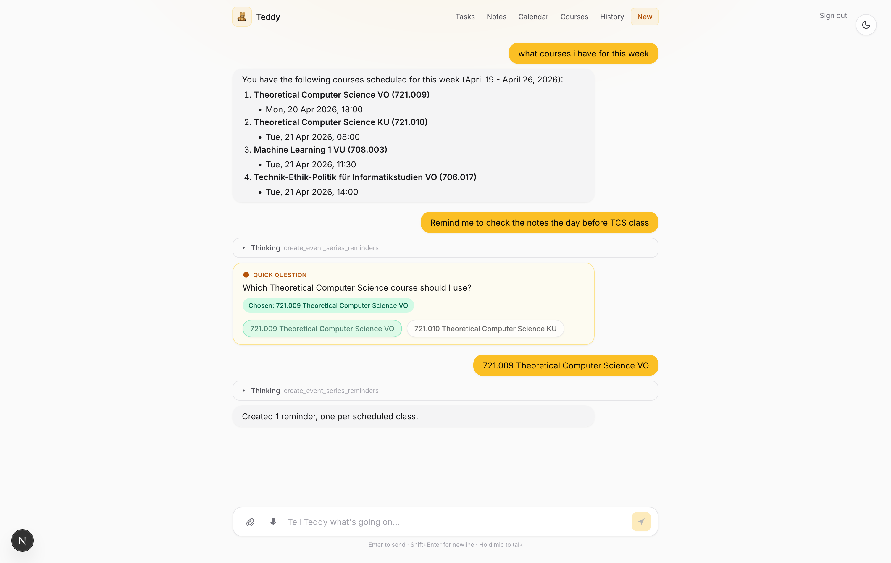
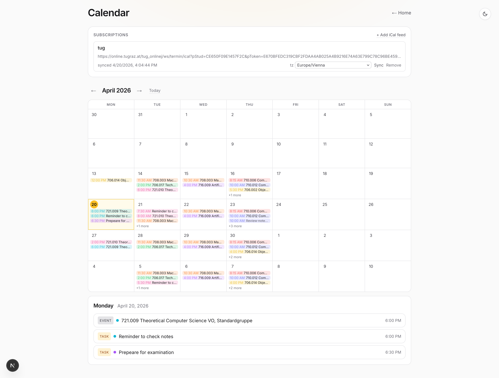
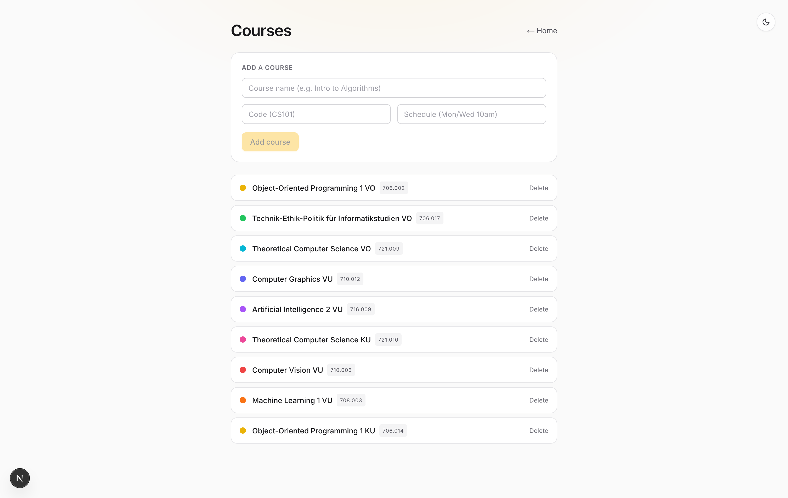

# Teddy

An AI study assistant for students.

Teddy turns the messy reality of class — things professors say in passing, deadlines buried in slides, reminders scribbled mid-lecture — into structured tasks, notes, and calendar events, each linked to the right course.

## What it does

You type whatever came out of class, in your own words:

> *in CS101 today teacher said read chapter 3 before next Monday*

Teddy figures out whether it's a task or a note, pulls out the due date, matches it to the right course, and files it. No forms, no tagging, no taxonomy to learn up front.

Subscribe to your university's iCal feed and your existing class schedule shows up alongside the tasks Teddy creates, so the calendar reflects everything in one place.

## Screenshots

### Assistant

The main surface. One text box. Teddy asks back when it needs to disambiguate — which of two overlapping courses you meant, for example — and tells you exactly what it created.

### Calendar

Your university calendar subscription and Teddy's own tasks and reminders, rendered on the same month view.

### Courses

Your course list is the anchor. Every task, note, and reminder links back to one of these.

## Mobile

The repo has iOS and Android app scaffolding, but the web app is where everything ships first. Mobile is not usable yet.

## A typical flow

1. Add your courses — name, code, rough schedule.
2. Optionally paste your university iCal URL on the calendar page.
3. Open the assistant and start dumping whatever you'd otherwise forget.

## Development

Setup, commands, and architecture notes live in [DEVELOP.md](./DEVELOP.md).
